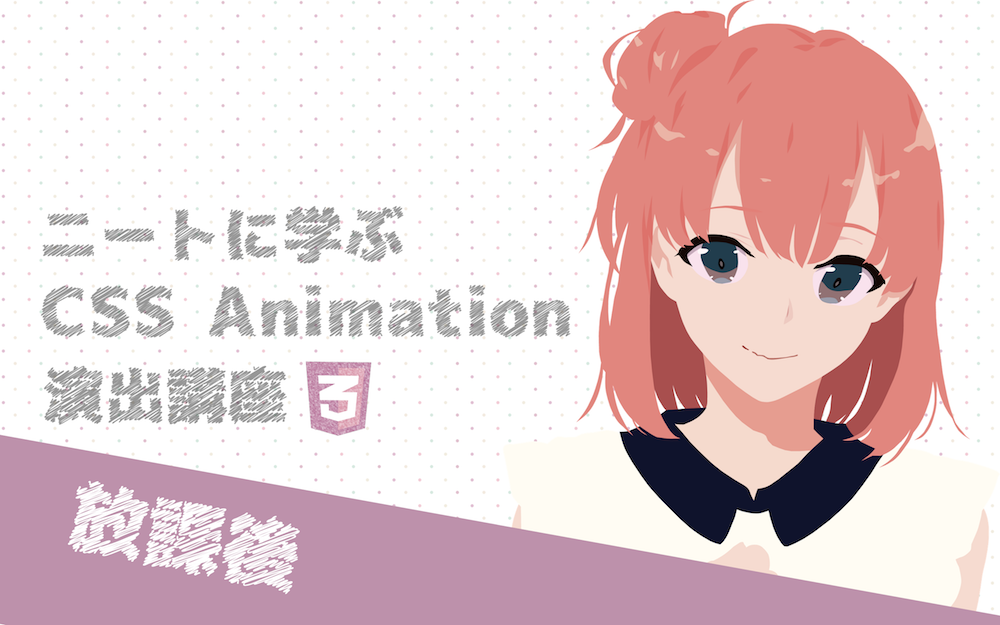

# ニートに学ぶCSS Animation演出講座 放課後
「ニートに学ぶCSS Animation演出講座」シリーズの生放送版の作品です。

各パートにあるcompleteディレクトリが完成品のコードで、studyディレクトリが受講用の最低限のコードが入っています。

- part1
  - 動画
    - <https://www.youtube.com/watch?v=wFJ8WB4G4KM>
  - ソースコード
    - <https://github.com/yui540/css_animation_live/tree/master/part1>
- part2
  - 動画
    - <https://www.youtube.com/watch?v=D9FgXH6HX6g>
  - ソースコード
    - <https://github.com/yui540/css_animation_live/tree/master/part2>
